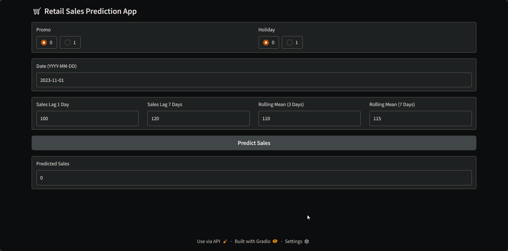

# Sales Forecasting with LightGBM

A retail sales prediction application built with LightGBM and Gradio for interactive forecasting.

## 📊 Demo



[Watch Demo Video](./demo/demo.mp4)

## ✨ Features

- Interactive web interface for sales prediction
- Takes into account various features including:
  - Promotional events
  - Holiday status
  - Historical sales data (various lags and rolling means)
  - Temporal features (day, month, year, day of week)
- Built with LightGBM for fast and accurate predictions
- Simple and intuitive user interface

## 🚀 Installation

1. Clone the repository:
   ```bash
   git clone https://github.com/yourusername/sales-forecasting.git
   cd sales-forecasting
   ```

2. Create and activate a virtual environment:
   ```bash
   # Create a virtual environment
   python -m venv .venv
   
   # Activate it
   # On Linux/Mac:
   source .venv/bin/activate
   # On Windows:
   .venv\Scripts\activate
   ```

3. Install the required dependencies:
   ```bash
   pip install -r requirements.txt
   ```

## 🛠️ Usage

1. Run the application:
   ```bash
   python app.py
   ```

2. Open your web browser and navigate to the URL shown in the terminal (typically http://localhost:7860)

3. Input the required information:
   - Promo status (0 or 1)
   - Holiday status (0 or 1)
   - Date in YYYY-MM-DD format
   - Sales lags and rolling means

4. Click "Predict Sales" to see the prediction

## 📦 Dependencies

- gradio >= 3.50.0
- joblib >= 1.3.0
- lightgbm >= 4.0.0
- pandas >= 2.0.0

## 🤝 Contributing

Contributions are welcome! Please feel free to submit a Pull Request.

1. Fork the repository
2. Create your feature branch (`git checkout -b feature/AmazingFeature`)
3. Commit your changes (`git commit -m 'Add some AmazingFeature'`)
4. Push to the branch (`git push origin feature/AmazingFeature`)
5. Open a Pull Request

## 📄 License

This project is licensed under the MIT License - see the [LICENSE](LICENSE) file for details.

## 🙏 Acknowledgements

- [LightGBM](https://github.com/microsoft/LightGBM) - The gradient boosting framework used for predictions
- [Gradio](https://gradio.app/) - For the simple web interface
- [Pandas](https://pandas.pydata.org/) - For data manipulation and analysis
